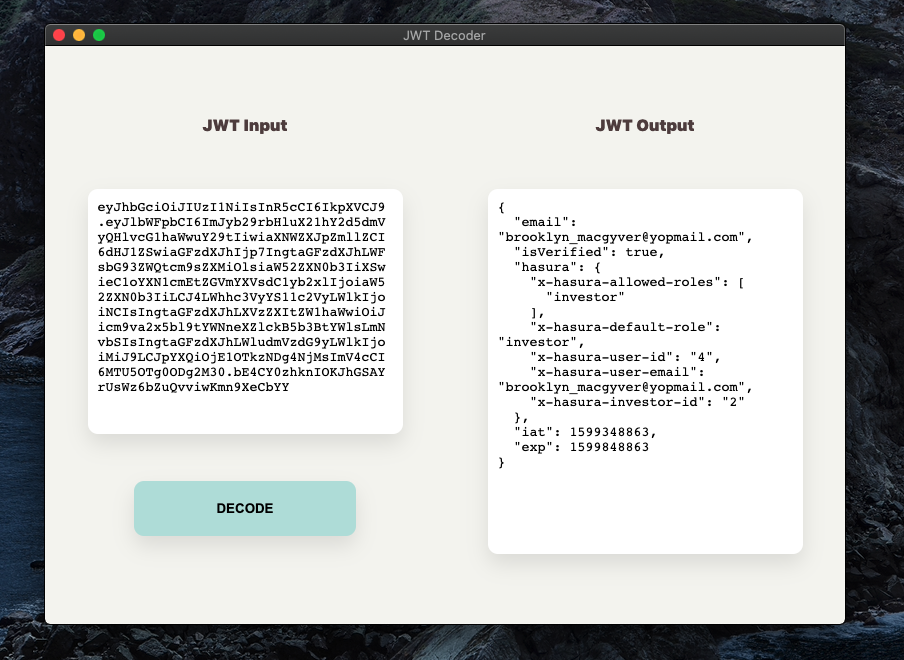

# JWT Decoder Application

Simple desktop app that's used to decode JWT tokens offline.

## Running Locally

- Follow the documentaion at [Electron](https://www.electronjs.org/docs/tutorial/development-environment) main site to setup your local development environment.
- Clone the repo, cd into the cloned project, run `npm i` then `npm start`.
